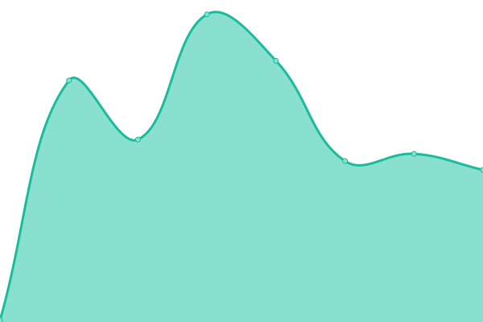
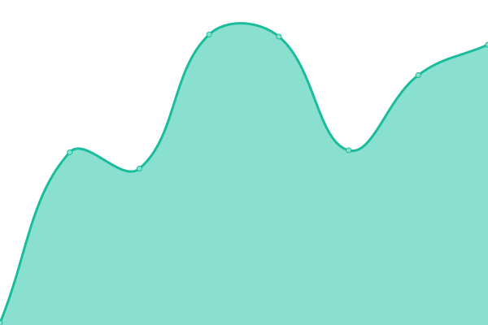

# [📈 Live Status](https://status.nftxledger.com): <!--live status--> **🟧 Partial outage**

This repository contains the open-source uptime monitor and status page for [Upptime](https://upptime.js.org), powered by [Upptime](https://github.com/upptime/upptime).

With [Upptime](https://upptime.js.org), you can get your own unlimited and free uptime monitor and status page, powered entirely by a GitHub repository. We use [Issues](https://github.com/upptime/upptime/issues) as incident reports, [Actions](https://github.com/nftxledger/status-page.github.io/actions) as uptime monitors, and [Pages](https://status.nftxledger.com) for the status page.

<!--start: status pages-->
<!-- This summary is generated by Upptime (https://github.com/upptime/upptime) -->
<!-- Do not edit this manually, your changes will be overwritten -->
<!-- prettier-ignore -->
| URL | Status | History | Response Time | Uptime |
| --- | ------ | ------- | ------------- | ------ |
|  [NFTx Ledger](https://nftxledger.com) | 🟩 Up | [nf-tx-ledger.yml](https://github.com/nftxledger/status-page.github.io/commits/HEAD/history/nf-tx-ledger.yml) | 

 202ms
     
 | 

<a href="https://status.nftxledger.com/history/nf-tx-ledger">100.00%</a>
    

|  [NFTx Trade](https://nftxtrade.com) | 🟩 Up | [nf-tx-trade.yml](https://github.com/nftxledger/status-page.github.io/commits/HEAD/history/nf-tx-trade.yml) | 

 222ms
     
 | 

<a href="https://status.nftxledger.com/history/nf-tx-trade">100.00%</a>
    

|  [NFTx Ledger (WWW)](https://www.nftxledger.com) | 🟥 Down | [nf-tx-ledger-www.yml](https://github.com/nftxledger/status-page.github.io/commits/HEAD/history/nf-tx-ledger-www.yml) | 

 103ms
     
 | 

<a href="https://status.nftxledger.com/history/nf-tx-ledger-www">0.00%</a>
    

|  [NFTx Trade (WWW)](https://www.nftxtrade.com) | 🟥 Down | [nf-tx-trade-www.yml](https://github.com/nftxledger/status-page.github.io/commits/HEAD/history/nf-tx-trade-www.yml) | 

 112ms
     
 | 

<a href="https://status.nftxledger.com/history/nf-tx-trade-www">0.00%</a>
    

<!--end: status pages-->

[**Visit our status website →**](https://status.nftxledger.com)

## 📄 License

- Powered by: [Upptime](https://github.com/upptime/upptime)
- Code: [MIT](./LICENSE) © [Upptime](https://upptime.js.org)
- Data in the `./history` directory: [Open Database License](https://opendatacommons.org/licenses/odbl/1-0/)
